ISLR, Chapter 6 - Linear Model Selection and Regularization
================
May 16 - 17, 2020

``` r
library(ISLR)
library(tidyverse)
```

    ## -- Attaching packages ---------------------------------------------------------------------------- tidyverse 1.3.0 --

    ## v ggplot2 3.3.0     v purrr   0.3.4
    ## v tibble  3.0.1     v dplyr   0.8.5
    ## v tidyr   1.0.2     v stringr 1.4.0
    ## v readr   1.3.1     v forcats 0.5.0

    ## -- Conflicts ------------------------------------------------------------------------------- tidyverse_conflicts() --
    ## x dplyr::filter() masks stats::filter()
    ## x dplyr::lag()    masks stats::lag()

We will use the `Hitters` database, a baseball database that has
statistics for different baseball players, including the variable
`Salary`, which we will be using as the response variable.

Looking at it:

``` r
summary(Hitters)
```

    ##      AtBat            Hits         HmRun            Runs       
    ##  Min.   : 16.0   Min.   :  1   Min.   : 0.00   Min.   :  0.00  
    ##  1st Qu.:255.2   1st Qu.: 64   1st Qu.: 4.00   1st Qu.: 30.25  
    ##  Median :379.5   Median : 96   Median : 8.00   Median : 48.00  
    ##  Mean   :380.9   Mean   :101   Mean   :10.77   Mean   : 50.91  
    ##  3rd Qu.:512.0   3rd Qu.:137   3rd Qu.:16.00   3rd Qu.: 69.00  
    ##  Max.   :687.0   Max.   :238   Max.   :40.00   Max.   :130.00  
    ##                                                                
    ##       RBI             Walks            Years            CAtBat       
    ##  Min.   :  0.00   Min.   :  0.00   Min.   : 1.000   Min.   :   19.0  
    ##  1st Qu.: 28.00   1st Qu.: 22.00   1st Qu.: 4.000   1st Qu.:  816.8  
    ##  Median : 44.00   Median : 35.00   Median : 6.000   Median : 1928.0  
    ##  Mean   : 48.03   Mean   : 38.74   Mean   : 7.444   Mean   : 2648.7  
    ##  3rd Qu.: 64.75   3rd Qu.: 53.00   3rd Qu.:11.000   3rd Qu.: 3924.2  
    ##  Max.   :121.00   Max.   :105.00   Max.   :24.000   Max.   :14053.0  
    ##                                                                      
    ##      CHits            CHmRun           CRuns             CRBI        
    ##  Min.   :   4.0   Min.   :  0.00   Min.   :   1.0   Min.   :   0.00  
    ##  1st Qu.: 209.0   1st Qu.: 14.00   1st Qu.: 100.2   1st Qu.:  88.75  
    ##  Median : 508.0   Median : 37.50   Median : 247.0   Median : 220.50  
    ##  Mean   : 717.6   Mean   : 69.49   Mean   : 358.8   Mean   : 330.12  
    ##  3rd Qu.:1059.2   3rd Qu.: 90.00   3rd Qu.: 526.2   3rd Qu.: 426.25  
    ##  Max.   :4256.0   Max.   :548.00   Max.   :2165.0   Max.   :1659.00  
    ##                                                                      
    ##      CWalks        League  Division    PutOuts          Assists     
    ##  Min.   :   0.00   A:175   E:157    Min.   :   0.0   Min.   :  0.0  
    ##  1st Qu.:  67.25   N:147   W:165    1st Qu.: 109.2   1st Qu.:  7.0  
    ##  Median : 170.50                    Median : 212.0   Median : 39.5  
    ##  Mean   : 260.24                    Mean   : 288.9   Mean   :106.9  
    ##  3rd Qu.: 339.25                    3rd Qu.: 325.0   3rd Qu.:166.0  
    ##  Max.   :1566.00                    Max.   :1378.0   Max.   :492.0  
    ##                                                                     
    ##      Errors          Salary       NewLeague
    ##  Min.   : 0.00   Min.   :  67.5   A:176    
    ##  1st Qu.: 3.00   1st Qu.: 190.0   N:146    
    ##  Median : 6.00   Median : 425.0            
    ##  Mean   : 8.04   Mean   : 535.9            
    ##  3rd Qu.:11.00   3rd Qu.: 750.0            
    ##  Max.   :32.00   Max.   :2460.0            
    ##                  NA's   :59

`Salary` has 59 null values. To deal with this we will drop those
observations.

``` r
Hitters <- drop_na(Hitters)

# Double check if there are any remaining NAs
sum(is.na(Hitters$Salary))
```

    ## [1] 0

# Best Subset Regression

Best Subest Regression looks through all possible regression models of
all different subset sizes, gets the best of each size, then chooses the
best one.

The library {leaps} can be used to evaluate the best subset models using
the function `regsubsets()`. By default it only goes up to subsets of
size 8, but in this dataset we have 19 variables and since we’re doing
BSR, we want 19 subsets. We will define that using `nvmax =`

``` r
library(leaps)
regfit_full = regsubsets(Salary ~ ., data = Hitters, nvmax = 19)

# Get the summary
regfit_summary = summary(regfit_full)

# Look at the metrics in the summary contains for each of the best subset models
names(regfit_summary)
```

    ## [1] "which"  "rsq"    "rss"    "adjr2"  "cp"     "bic"    "outmat" "obj"

``` r
# Cp - an estimate of prediction error
regfit_summary$cp
```

    ##  [1] 104.281319  50.723090  38.693127  27.856220  21.613011  14.023870
    ##  [7]  13.128474   7.400719   6.158685   5.009317   5.874113   7.330766
    ## [13]   8.888112  10.481576  12.346193  14.187546  16.087831  18.011425
    ## [19]  20.000000

``` r
# Pick the model with the lowest Cp, which we can check by plotting the Cps
plot(regfit_summary$cp, xlab = "Number of Variables", ylab = "Cp")
# The model with the lowest Cp is the one with 10 variables. We can also check this using the `which()` function:
which.min(regfit_summary$cp)
```

    ## [1] 10

``` r
# Adding a marker to the plot to indicate it
points(10,regfit_summary$cp[10], pch = 20, col = "red")
```

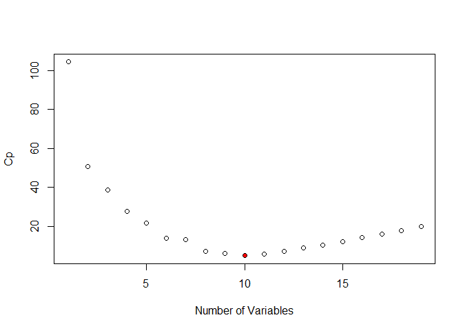<!-- -->

Interpreting the summary: Rows - subset size (number of predictors in
the subset) Value/stars - whether that variable is in the model

The model with the lowest Cp is the one with 10 variables.

We can also plot the `regsubsets` object to get a summary of all the
models, instead of just seeing the Cp statistic:

``` r
plot(regfit_full, scale = "Cp") 
```

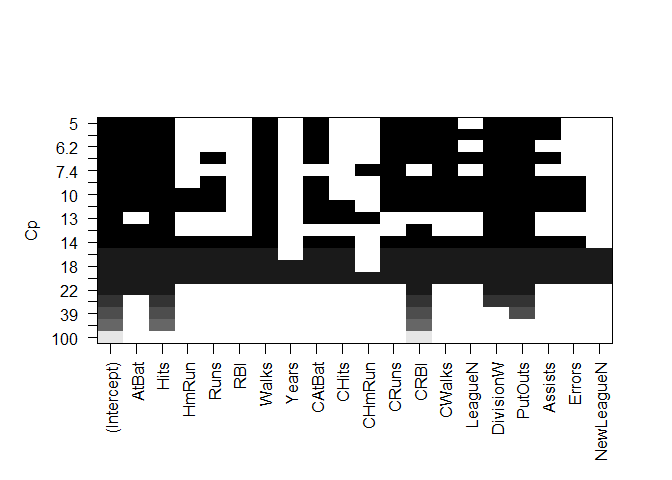<!-- -->

Interpretation: As expected, the model with the lowest Cp is at the top,
the black squares indicate the variable is in the model, and we can see
at first the models are reasonably stable, many of the variables stay
the same with a little bit of fluctuation. We can also see that the
models with the worst Cps are the ones with either too many or too
little variables.

Now that we choose the model with 10 variables, we can get the
coefficents for that model.

``` r
coef(regfit_full,10)
```

    ##  (Intercept)        AtBat         Hits        Walks       CAtBat        CRuns 
    ##  162.5354420   -2.1686501    6.9180175    5.7732246   -0.1300798    1.4082490 
    ##         CRBI       CWalks    DivisionW      PutOuts      Assists 
    ##    0.7743122   -0.8308264 -112.3800575    0.2973726    0.2831680

# Forward Stepwise Selection

Forward Stepwise Selection produces nested sequences. It can be done
using the same function `regsubsets`, where you specify the method as
being “forward”.

``` r
regfit_forward = regsubsets(Salary ~ ., data = Hitters, nvmax = 19, method = "forward")
summary(regfit_forward)
```

    ## Subset selection object
    ## Call: regsubsets.formula(Salary ~ ., data = Hitters, nvmax = 19, method = "forward")
    ## 19 Variables  (and intercept)
    ##            Forced in Forced out
    ## AtBat          FALSE      FALSE
    ## Hits           FALSE      FALSE
    ## HmRun          FALSE      FALSE
    ## Runs           FALSE      FALSE
    ## RBI            FALSE      FALSE
    ## Walks          FALSE      FALSE
    ## Years          FALSE      FALSE
    ## CAtBat         FALSE      FALSE
    ## CHits          FALSE      FALSE
    ## CHmRun         FALSE      FALSE
    ## CRuns          FALSE      FALSE
    ## CRBI           FALSE      FALSE
    ## CWalks         FALSE      FALSE
    ## LeagueN        FALSE      FALSE
    ## DivisionW      FALSE      FALSE
    ## PutOuts        FALSE      FALSE
    ## Assists        FALSE      FALSE
    ## Errors         FALSE      FALSE
    ## NewLeagueN     FALSE      FALSE
    ## 1 subsets of each size up to 19
    ## Selection Algorithm: forward
    ##           AtBat Hits HmRun Runs RBI Walks Years CAtBat CHits CHmRun CRuns CRBI
    ## 1  ( 1 )  " "   " "  " "   " "  " " " "   " "   " "    " "   " "    " "   "*" 
    ## 2  ( 1 )  " "   "*"  " "   " "  " " " "   " "   " "    " "   " "    " "   "*" 
    ## 3  ( 1 )  " "   "*"  " "   " "  " " " "   " "   " "    " "   " "    " "   "*" 
    ## 4  ( 1 )  " "   "*"  " "   " "  " " " "   " "   " "    " "   " "    " "   "*" 
    ## 5  ( 1 )  "*"   "*"  " "   " "  " " " "   " "   " "    " "   " "    " "   "*" 
    ## 6  ( 1 )  "*"   "*"  " "   " "  " " "*"   " "   " "    " "   " "    " "   "*" 
    ## 7  ( 1 )  "*"   "*"  " "   " "  " " "*"   " "   " "    " "   " "    " "   "*" 
    ## 8  ( 1 )  "*"   "*"  " "   " "  " " "*"   " "   " "    " "   " "    "*"   "*" 
    ## 9  ( 1 )  "*"   "*"  " "   " "  " " "*"   " "   "*"    " "   " "    "*"   "*" 
    ## 10  ( 1 ) "*"   "*"  " "   " "  " " "*"   " "   "*"    " "   " "    "*"   "*" 
    ## 11  ( 1 ) "*"   "*"  " "   " "  " " "*"   " "   "*"    " "   " "    "*"   "*" 
    ## 12  ( 1 ) "*"   "*"  " "   "*"  " " "*"   " "   "*"    " "   " "    "*"   "*" 
    ## 13  ( 1 ) "*"   "*"  " "   "*"  " " "*"   " "   "*"    " "   " "    "*"   "*" 
    ## 14  ( 1 ) "*"   "*"  "*"   "*"  " " "*"   " "   "*"    " "   " "    "*"   "*" 
    ## 15  ( 1 ) "*"   "*"  "*"   "*"  " " "*"   " "   "*"    "*"   " "    "*"   "*" 
    ## 16  ( 1 ) "*"   "*"  "*"   "*"  "*" "*"   " "   "*"    "*"   " "    "*"   "*" 
    ## 17  ( 1 ) "*"   "*"  "*"   "*"  "*" "*"   " "   "*"    "*"   " "    "*"   "*" 
    ## 18  ( 1 ) "*"   "*"  "*"   "*"  "*" "*"   "*"   "*"    "*"   " "    "*"   "*" 
    ## 19  ( 1 ) "*"   "*"  "*"   "*"  "*" "*"   "*"   "*"    "*"   "*"    "*"   "*" 
    ##           CWalks LeagueN DivisionW PutOuts Assists Errors NewLeagueN
    ## 1  ( 1 )  " "    " "     " "       " "     " "     " "    " "       
    ## 2  ( 1 )  " "    " "     " "       " "     " "     " "    " "       
    ## 3  ( 1 )  " "    " "     " "       "*"     " "     " "    " "       
    ## 4  ( 1 )  " "    " "     "*"       "*"     " "     " "    " "       
    ## 5  ( 1 )  " "    " "     "*"       "*"     " "     " "    " "       
    ## 6  ( 1 )  " "    " "     "*"       "*"     " "     " "    " "       
    ## 7  ( 1 )  "*"    " "     "*"       "*"     " "     " "    " "       
    ## 8  ( 1 )  "*"    " "     "*"       "*"     " "     " "    " "       
    ## 9  ( 1 )  "*"    " "     "*"       "*"     " "     " "    " "       
    ## 10  ( 1 ) "*"    " "     "*"       "*"     "*"     " "    " "       
    ## 11  ( 1 ) "*"    "*"     "*"       "*"     "*"     " "    " "       
    ## 12  ( 1 ) "*"    "*"     "*"       "*"     "*"     " "    " "       
    ## 13  ( 1 ) "*"    "*"     "*"       "*"     "*"     "*"    " "       
    ## 14  ( 1 ) "*"    "*"     "*"       "*"     "*"     "*"    " "       
    ## 15  ( 1 ) "*"    "*"     "*"       "*"     "*"     "*"    " "       
    ## 16  ( 1 ) "*"    "*"     "*"       "*"     "*"     "*"    " "       
    ## 17  ( 1 ) "*"    "*"     "*"       "*"     "*"     "*"    "*"       
    ## 18  ( 1 ) "*"    "*"     "*"       "*"     "*"     "*"    "*"       
    ## 19  ( 1 ) "*"    "*"     "*"       "*"     "*"     "*"    "*"

``` r
plot(regfit_forward, scale = "Cp")
```

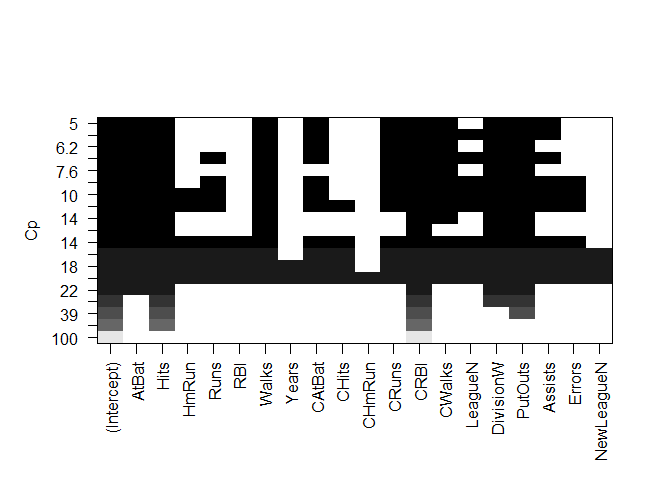<!-- -->

The structure looks similar to the one made by the best subset
selection, especially with the better models.

Instead of using Cp, the adjusted R squared, and the other metrics
provided by the function that are in the summary, we will use a
Validation set to choose the best model.

# Model Selection - Using a Validation Set

We will make a training and validation set so that we can choose a good
subset model. This will be a different approach from what is done in the
book.

Then we’ll fit another model using `regsubsets()` again but only using
the training set (taken using the indexes gotten using `sample()`).

``` r
# Look at the dimensions of the table
dim(Hitters)
```

    ## [1] 263  20

``` r
## there are 263 observations and 20 variables-- we can do 2/3 (~180 obs) training 1/3 test

set.seed(1)

# Get a sample of 180 indexes
train = sample(seq(263),180,replace = FALSE)
train
```

    ##   [1] 167 129 187  85  79 213  37 105 217 110 229 165  34 106 126  89 172 207
    ##  [19]  33  84 163  70  74  42 166 111 148 156  20  44 121  87 242 233  40 247
    ##  [37]  25 119 198 122  39 179 240 134  24 160  14 130  45 146  22 206 193 115
    ##  [55] 104 231 208 209 103  75  13 253 176 248  23 254 244 205  29 141 150 236
    ##  [73] 108  48 245 215 149  31 102 145  73 232  83 118  90 190 107  64 196  60
    ##  [91]  51 251 138 262  43  26 143 195 152 178 223 219 202 181 222 169   1 239
    ## [109]  78 211 246  28 116 257  61 113  86  71 225  99 173 234  49 256 174 194
    ## [127]  50 135 238 235 230 263  53 100 164  65 142 175 140 124 224  77 159  98
    ## [145]  66  19  17 228 204 186  35 144  46 180 109 210  16 161   9 137  92 162
    ## [163]  10 259  32 243  95 154  93  12 255 177  15   2 128  67 183 117 197   5

``` r
regfit_forward = regsubsets(Salary ~ ., data = Hitters[train,], nvmax = 19, method = "forward")
```

Now we can make predictions on the observations used for training
(testing data).

We know there are 19 models so we have to set up some vectors to record
the errors, and we have to do work here because there is no predict
method for `regsubsets`.

``` r
# Set up a vector having 19 slots
val_errors = rep(NA, 19)

# Make validation dataset
X_test = model.matrix(Salary ~ ., data = Hitters[-train,]) ## -index to get the non-training data

# Make predictions for each model
for (i in  1:19) {
  coefi = coef(regfit_forward, id = i)
  pred = X_test[,names(coefi)]%*%coefi
  val_errors[i] = mean((Hitters$Salary[-train] - pred)^2)
}

# Plot the root MSE (validation) and RSS (training)
  plot(sqrt(val_errors), ylab = "Root MSE",ylim = c(300,410), pch = 19, type = "b")
  points(sqrt(regfit_forward$rss[-1]/180), col = "blue", pch = 19, type = "b")
```

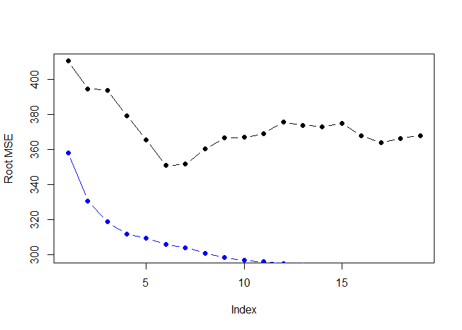<!-- -->

Now we’ll write a predict method function for `regsubsets`:

``` r
predict_regsubsets = function(object, newdata, id, ....) {
  form = as.formula(object$call[[2]])
  mat = model.matrix(form, newdata)
  coefi = coef(object, id = id)
  mat[, names(coefi)]%*%coefi
}
```

# Model Selection - Using Cross-Validation

10-fold cross-validation:

``` r
set.seed(11)

# Assign each observation a fold number (1-10), randomly assigned using sample()
folds = sample(rep(1:10, length = nrow(Hitters)))
folds
```

    ##   [1] 10  4  4  4  3  7 10  8 10  3  4  2  2  1  1  5  3  3  5  9  5  2  7  3  8
    ##  [26]  7  4  6  7  7  7 10  2  6  6  1  8  8 10  1  8  3  7 10  1  6 10  3  8  7
    ##  [51]  9  3  6  2  5  6  5  5  2  6  4  7 10  7  1  8  1  2  8  2  1  8  2  6  4
    ##  [76]  3  1  1  5  1  2 10  5  8  8  3  9  8  3  6  1  9  5  9  9  8  8  6  8 10
    ## [101]  9  8  7  8 10  1  3  1 10  5  2  5  2  4  4 10  3  6  9  7  4  3  9  8 10
    ## [126]  7  5  9 10  4  7  4  1  9  4  5  6  8 10  6  7  1 10  6  4  6  7  1  9  4
    ## [151]  2  1  7  2  5  7 10  7  9  6  9  5  5  4 10  4  2 10  9  3  3  2  9  2  6
    ## [176]  9  4  3  9  9  9  4  6  1  7  8  5  8 10  6  9  8  9  1  5  3  3  1  7  1
    ## [201]  2  9  1  9 10  3 10  3  4  6  8  2  9  5  7  2 10  4  1  6 10  3  5  5  3
    ## [226]  5  7  3  6  5  4  1  3  7  1  5  2  9  4  6  8  3  2  4  5 10  8  5  2  2
    ## [251]  2  6  3  4  7  2  6  4  8  7  1  2  6

``` r
# See how balanced the distribution of the observations is to each fold by tabulating the counts
table(folds)
```

    ## folds
    ##  1  2  3  4  5  6  7  8  9 10 
    ## 27 27 27 26 26 26 26 26 26 26

``` r
# Make a matrix for the errors 10 rows (one for each of the 10 folds), 19 columns (19 variables = 19 subsets)
cv_errors = matrix(NA, 10, 19)
cv_errors
```

    ##       [,1] [,2] [,3] [,4] [,5] [,6] [,7] [,8] [,9] [,10] [,11] [,12] [,13]
    ##  [1,]   NA   NA   NA   NA   NA   NA   NA   NA   NA    NA    NA    NA    NA
    ##  [2,]   NA   NA   NA   NA   NA   NA   NA   NA   NA    NA    NA    NA    NA
    ##  [3,]   NA   NA   NA   NA   NA   NA   NA   NA   NA    NA    NA    NA    NA
    ##  [4,]   NA   NA   NA   NA   NA   NA   NA   NA   NA    NA    NA    NA    NA
    ##  [5,]   NA   NA   NA   NA   NA   NA   NA   NA   NA    NA    NA    NA    NA
    ##  [6,]   NA   NA   NA   NA   NA   NA   NA   NA   NA    NA    NA    NA    NA
    ##  [7,]   NA   NA   NA   NA   NA   NA   NA   NA   NA    NA    NA    NA    NA
    ##  [8,]   NA   NA   NA   NA   NA   NA   NA   NA   NA    NA    NA    NA    NA
    ##  [9,]   NA   NA   NA   NA   NA   NA   NA   NA   NA    NA    NA    NA    NA
    ## [10,]   NA   NA   NA   NA   NA   NA   NA   NA   NA    NA    NA    NA    NA
    ##       [,14] [,15] [,16] [,17] [,18] [,19]
    ##  [1,]    NA    NA    NA    NA    NA    NA
    ##  [2,]    NA    NA    NA    NA    NA    NA
    ##  [3,]    NA    NA    NA    NA    NA    NA
    ##  [4,]    NA    NA    NA    NA    NA    NA
    ##  [5,]    NA    NA    NA    NA    NA    NA
    ##  [6,]    NA    NA    NA    NA    NA    NA
    ##  [7,]    NA    NA    NA    NA    NA    NA
    ##  [8,]    NA    NA    NA    NA    NA    NA
    ##  [9,]    NA    NA    NA    NA    NA    NA
    ## [10,]    NA    NA    NA    NA    NA    NA

``` r
for (k in 1:10) {
  # Train on all subsets != k, leaving out the k fold to be used for testing
  best_fit = regsubsets(Salary ~ ., data = Hitters[folds != k,], nvmax = 19, method = "forward")
  
  # Look at each of the subsets in the trained model
  for (i in 1:19) {
    # Use the predict method we just made 
    # best_fit is our regsubsets object
    # make predictions using the k fold (testing set)
    pred = predict_regsubsets(best_fit, Hitters[folds == k,], id = i)
    # Put MSE of predictions into the k-th row of cv_errors
    # 10 rows (folds), 19 columns (subsets/models)
    cv_errors[k,i] = mean( (Hitters$Salary[folds == k] - pred)^2 )
  }
}

# Process the output matrix
# apply function to the columns to get the column means (mean of all the 10 folds' MSE per subset)
# sqrt() to get the RMSE
rmse_cv = sqrt(apply(cv_errors, 2, mean))

# Plot the RMSE
plot(rmse_cv, pch = 19, type = "b")
```

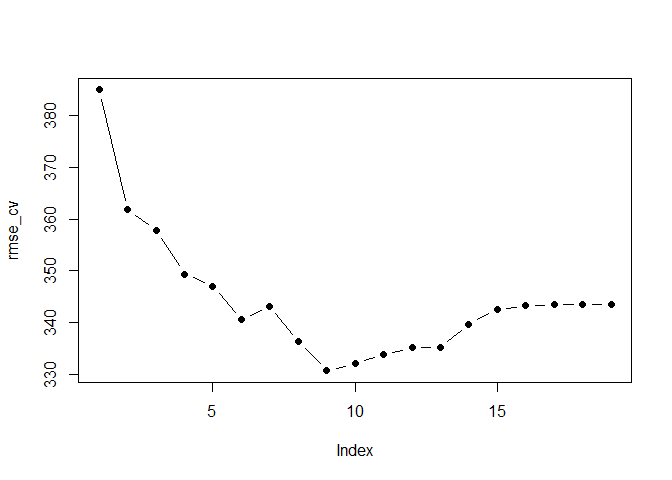<!-- -->

# Ridge Regression

To fit a ridge regression model, we’ll use the `glmnet` package, which
does not use the model formula language, so we will set up on `x` and
`y`.

`glmnet()` fits models on a whole range of lambda values

Ridge regression - alpha = 0 (keeps all predictors) Lasso - alpha = 1
(does shrinkage & variable selection) Elastic net models - alpha = (0,1)

`cv.glmnet` does cross validation for you.

``` r
library(glmnet)
```

    ## Loading required package: Matrix

    ## 
    ## Attaching package: 'Matrix'

    ## The following objects are masked from 'package:tidyr':
    ## 
    ##     expand, pack, unpack

    ## Loaded glmnet 4.0

``` r
X = model.matrix(Salary ~ .-1, data = Hitters)
y = Hitters$Salary

# Ridge regression
fit_ridge = glmnet(X, y, alpha = 0)
plot(fit_ridge, xvar = "lambda", label = TRUE)
```

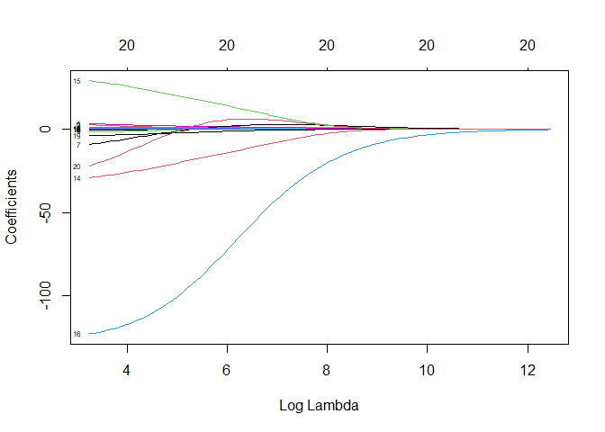<!-- -->

The numebers at the top indicate how many variables (predictors +
intercept) are in the models/stages.

The far left of the plot shows the coefficients of the least quares fit
where lambda = 0 & coeffficients are unregularized.

Now we need to pick a value of lambda, which we can use `cv.glmnet` for.
The default is 10-fold cross-validation.

``` r
cv_ridge = cv.glmnet(X, y, alpha = 0)
plot(cv_ridge)
```

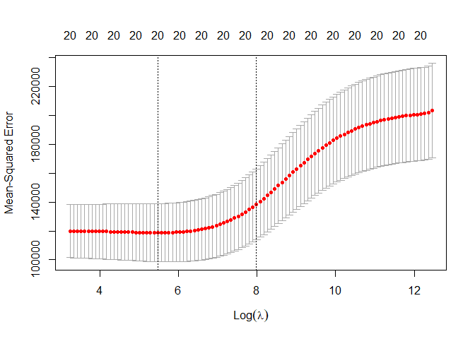<!-- -->

The plot seems to indicate that the full model is actually doing a
pretty good job.

The first dashed line indicates the minimum MSE, and the second line is
at one standard error of the minimum– a slightly more restricted model
that does almost as well as the minimum.

# Lasso Model

``` r
# Lasso model
fit_lasso = glmnet(X, y, alpha = 1)
plot(fit_lasso, xvar = "lambda", label = TRUE)
```

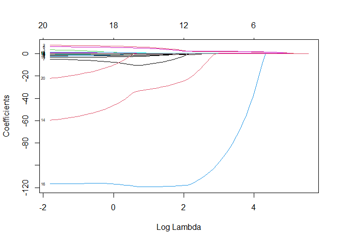<!-- -->

``` r
# We can also plot the percentage of deviance explained/in regression, R^2
plot(fit_lasso, xvar = "dev", label = TRUE)
```

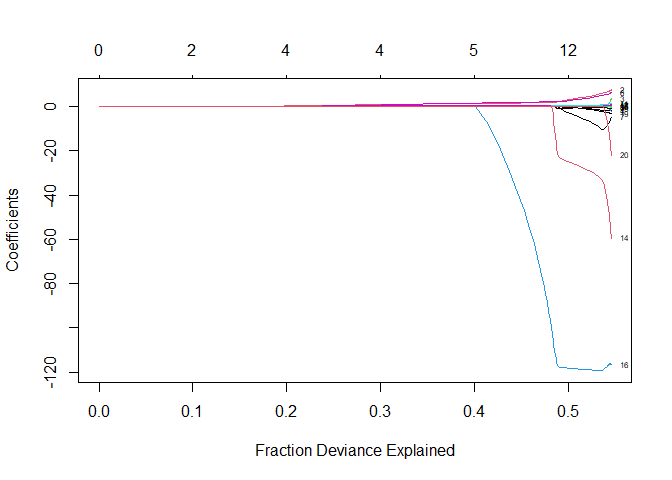<!-- -->

In the lasso lambda plot, the top still indicates how many variables are
in the model, and since lasso makes some coefficients 0, we can see the
when they’re removed.

In the deviance explained plot, the right hand side where the
coefficients are large may indicate overfitting.

``` r
cv_lasso = cv.glmnet(X, y, alpha = 1)
plot(cv_lasso)
```

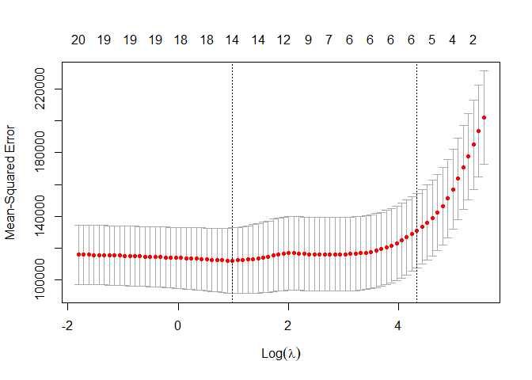<!-- -->

`fit_lasso` contains the whole path of coefficients– for all values of
lambda that it computed (\~100 coeff vectors indexed by different values
of lambda), but if you call `coef()` on the object created by
`cv.glmnet()`, in this case `cv_lasso`, it will only return the
coefficient vector corresponding to the best model.

``` r
coef(cv_lasso)
```

    ## 21 x 1 sparse Matrix of class "dgCMatrix"
    ##                        1
    ## (Intercept) 144.37970485
    ## AtBat         .         
    ## Hits          1.36380384
    ## HmRun         .         
    ## Runs          .         
    ## RBI           .         
    ## Walks         1.49731098
    ## Years         .         
    ## CAtBat        .         
    ## CHits         .         
    ## CHmRun        .         
    ## CRuns         0.15275165
    ## CRBI          0.32833941
    ## CWalks        .         
    ## LeagueA       .         
    ## LeagueN       .         
    ## DivisionW     .         
    ## PutOuts       0.06625755
    ## Assists       .         
    ## Errors        .         
    ## NewLeagueN    .

In this case, it’s the model of 5 predictors, the one one SD away from
the minimum MSE (more parsimonious- the CV error is measured with some
variance).

Now we’ll try using the earlier training/validation sets to select the
`lambda` for the lasso.

``` r
lasso_training = glmnet(X[train,], y[train])
lasso_training
```

    ## 
    ## Call:  glmnet(x = X[train, ], y = y[train]) 
    ## 
    ##    Df    %Dev  Lambda
    ## 1   0 0.00000 262.100
    ## 2   1 0.05919 238.800
    ## 3   1 0.10830 217.600
    ## 4   1 0.14910 198.300
    ## 5   2 0.19720 180.600
    ## 6   3 0.23940 164.600
    ## 7   3 0.27450 150.000
    ## 8   3 0.30370 136.700
    ## 9   3 0.32790 124.500
    ## 10  3 0.34800 113.500
    ## 11  4 0.36500 103.400
    ## 12  5 0.38770  94.190
    ## 13  6 0.40900  85.820
    ## 14  6 0.42730  78.200
    ## 15  6 0.44250  71.250
    ## 16  6 0.45510  64.920
    ## 17  6 0.46550  59.150
    ## 18  6 0.47420  53.900
    ## 19  6 0.48140  49.110
    ## 20  6 0.48740  44.750
    ## 21  6 0.49240  40.770
    ## 22  6 0.49650  37.150
    ## 23  6 0.49990  33.850
    ## 24  7 0.50280  30.840
    ## 25  7 0.50510  28.100
    ## 26  8 0.50710  25.610
    ## 27  8 0.50940  23.330
    ## 28  8 0.51120  21.260
    ## 29  8 0.51280  19.370
    ## 30  8 0.51410  17.650
    ## 31  8 0.51520  16.080
    ## 32  8 0.51600  14.650
    ## 33  8 0.51680  13.350
    ## 34  9 0.51750  12.170
    ## 35  9 0.51990  11.080
    ## 36 10 0.52230  10.100
    ## 37 10 0.52440   9.202
    ## 38 11 0.52640   8.385
    ## 39 11 0.52820   7.640
    ## 40 11 0.52970   6.961
    ## 41 11 0.53090   6.343
    ## 42 11 0.53190   5.779
    ## 43 12 0.53280   5.266
    ## 44 14 0.53530   4.798
    ## 45 14 0.53830   4.372
    ## 46 15 0.54060   3.984
    ## 47 16 0.54450   3.630
    ## 48 16 0.54790   3.307
    ## 49 16 0.55060   3.013
    ## 50 16 0.55290   2.746
    ## 51 17 0.55480   2.502
    ## 52 17 0.55650   2.280
    ## 53 17 0.55780   2.077
    ## 54 17 0.55890   1.892
    ## 55 18 0.56000   1.724
    ## 56 18 0.56160   1.571
    ## 57 18 0.56300   1.432
    ## 58 19 0.56420   1.304
    ## 59 19 0.56530   1.189
    ## 60 19 0.56630   1.083
    ## 61 19 0.56710   0.987
    ## 62 19 0.56770   0.899
    ## 63 19 0.56830   0.819
    ## 64 19 0.56880   0.746
    ## 65 19 0.56920   0.680
    ## 66 19 0.56950   0.620
    ## 67 19 0.56980   0.565
    ## 68 19 0.57000   0.514
    ## 69 19 0.57020   0.469
    ## 70 19 0.57040   0.427
    ## 71 19 0.57050   0.389
    ## 72 19 0.57060   0.355
    ## 73 19 0.57070   0.323
    ## 74 19 0.57080   0.294
    ## 75 19 0.57080   0.268
    ## 76 19 0.57090   0.244
    ## 77 19 0.57090   0.223
    ## 78 19 0.57100   0.203
    ## 79 19 0.57100   0.185
    ## 80 19 0.57110   0.168
    ## 81 19 0.57110   0.154
    ## 82 19 0.57110   0.140
    ## 83 19 0.57110   0.127

``` r
## the glmnet object contains the degrees of freedom, percentage of deviance explained (like R^2 for glms), and the lambda used to train that model/to that fit

pred = predict(lasso_training, X[-train,])
dim(pred)
```

    ## [1] 83 83

``` r
## there are 83 observations in the validation set and 83 values of lambda

rmse = sqrt(apply( (y[-train] - pred)^2, 2, mean))

# Plot the RMSEs of the different models
plot(log(lasso_training$lambda), rmse, type = "b", xlab = "Log(lambda)")
```

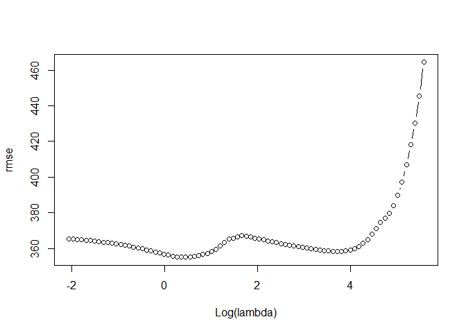<!-- -->

``` r
## left - overfitting, right - underfitting, middle - sweet spot

# Extract the best lambda
lam_best = lasso_training$lambda[order(rmse)[1]]
lam_best
```

    ## [1] 1.571184

``` r
# Get the coefficients of that model
coef(lasso_training, s = lam_best)
```

    ## 21 x 1 sparse Matrix of class "dgCMatrix"
    ##                         1
    ## (Intercept)  284.22742427
    ## AtBat         -1.14830040
    ## Hits           4.92901730
    ## HmRun          .         
    ## Runs          -3.51936866
    ## RBI            0.38309009
    ## Walks          6.01828596
    ## Years        -20.74174043
    ## CAtBat        -0.01903175
    ## CHits          0.08077424
    ## CHmRun         0.53493799
    ## CRuns          0.77272746
    ## CRBI           0.49203970
    ## CWalks        -0.47458673
    ## LeagueA      -91.21313136
    ## LeagueN        .         
    ## DivisionW   -161.10222986
    ## PutOuts        0.28639231
    ## Assists        0.29245560
    ## Errors        -4.69237401
    ## NewLeagueN   -56.95409378
