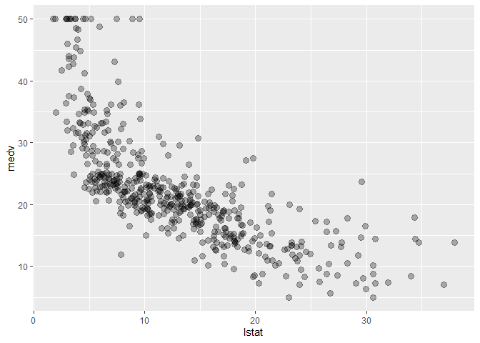
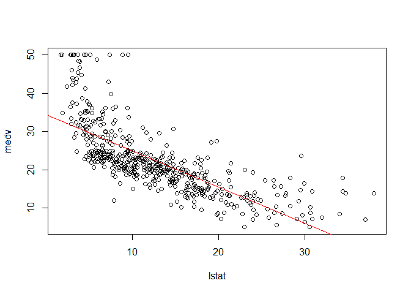
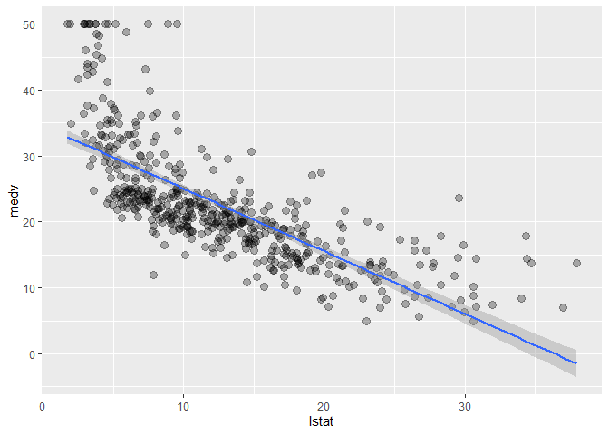
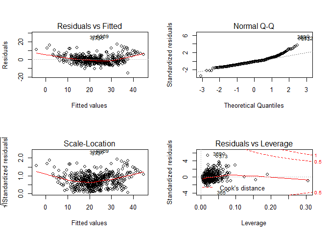
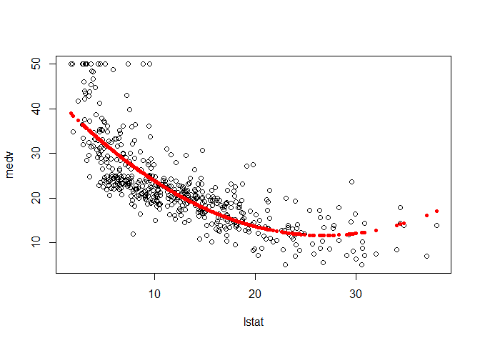
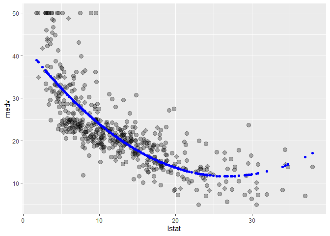
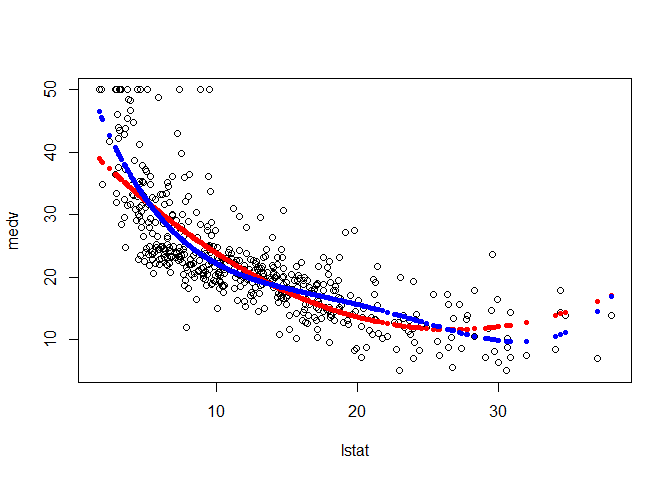
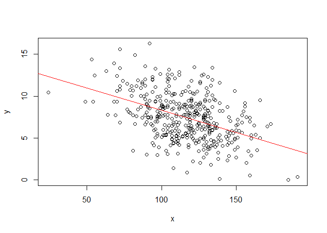

ISLR, Chapter 3
================

``` r
library(MASS)
library(ISLR)
library(tidyverse)
```

First, we will use the `Boston` dataset in the ISLR package. Let’s look
at it:

``` r
names(Boston) 
```

    ##  [1] "crim"    "zn"      "indus"   "chas"    "nox"     "rm"      "age"    
    ##  [8] "dis"     "rad"     "tax"     "ptratio" "black"   "lstat"   "medv"

``` r
# ?Boston
```

# Simple Linear Regression

Look at the median value of homes wrt the percentage of lower status
population:

``` r
Boston %>% 
  ggplot(aes(x = lstat, y = medv)) +
  geom_point(size = 3, alpha = .3)
```

<!-- -->

## Fit a linear model

``` r
fit1 = lm(medv ~ lstat, data = Boston)  ## ~ = "is modelled as"
fit1 ## brief summary
```

    ## 
    ## Call:
    ## lm(formula = medv ~ lstat, data = Boston)
    ## 
    ## Coefficients:
    ## (Intercept)        lstat  
    ##       34.55        -0.95

``` r
summary(fit1) ## more detailed summary
```

    ## 
    ## Call:
    ## lm(formula = medv ~ lstat, data = Boston)
    ## 
    ## Residuals:
    ##     Min      1Q  Median      3Q     Max 
    ## -15.168  -3.990  -1.318   2.034  24.500 
    ## 
    ## Coefficients:
    ##             Estimate Std. Error t value Pr(>|t|)    
    ## (Intercept) 34.55384    0.56263   61.41   <2e-16 ***
    ## lstat       -0.95005    0.03873  -24.53   <2e-16 ***
    ## ---
    ## Signif. codes:  0 '***' 0.001 '**' 0.01 '*' 0.05 '.' 0.1 ' ' 1
    ## 
    ## Residual standard error: 6.216 on 504 degrees of freedom
    ## Multiple R-squared:  0.5441, Adjusted R-squared:  0.5432 
    ## F-statistic: 601.6 on 1 and 504 DF,  p-value: < 2.2e-16

`lstat` is significant.

## Add the linear model fit to the plot

``` r
plot(medv ~ lstat, Boston)  ## add linear model fit to the plot
abline(fit1, col = "red")
```

<!-- -->

``` r
## in ggplot2
Boston %>% 
  ggplot(aes(x = lstat, y = medv)) +  ## add linear model fit to the plot
  geom_point(size = 3, alpha = .3) +
  geom_smooth(method = 'lm', formula = y ~ x)
```

<!-- -->

## Get the confidence interval for the coefficients

``` r
confint(fit1)  ## default is 95% CI
```

    ##                 2.5 %     97.5 %
    ## (Intercept) 33.448457 35.6592247
    ## lstat       -1.026148 -0.8739505

## Predict `medv` for 3 new values of `lstat` & get the CI

``` r
predict(fit1, data.frame(lstat = c(5,10,15)), interval = "confidence")
```

    ##        fit      lwr      upr
    ## 1 29.80359 29.00741 30.59978
    ## 2 25.05335 24.47413 25.63256
    ## 3 20.30310 19.73159 20.87461

# Multiple Linear Regression

``` r
fit2 = lm(medv ~ lstat + age, Boston)

summary(fit2)
```

    ## 
    ## Call:
    ## lm(formula = medv ~ lstat + age, data = Boston)
    ## 
    ## Residuals:
    ##     Min      1Q  Median      3Q     Max 
    ## -15.981  -3.978  -1.283   1.968  23.158 
    ## 
    ## Coefficients:
    ##             Estimate Std. Error t value Pr(>|t|)    
    ## (Intercept) 33.22276    0.73085  45.458  < 2e-16 ***
    ## lstat       -1.03207    0.04819 -21.416  < 2e-16 ***
    ## age          0.03454    0.01223   2.826  0.00491 ** 
    ## ---
    ## Signif. codes:  0 '***' 0.001 '**' 0.01 '*' 0.05 '.' 0.1 ' ' 1
    ## 
    ## Residual standard error: 6.173 on 503 degrees of freedom
    ## Multiple R-squared:  0.5513, Adjusted R-squared:  0.5495 
    ## F-statistic:   309 on 2 and 503 DF,  p-value: < 2.2e-16

`age` is also significant.

Now, let’s try to use all of the variables in `Boston` as predictors:

``` r
fit3 = lm(medv ~ ., Boston)

summary(fit3)
```

    ## 
    ## Call:
    ## lm(formula = medv ~ ., data = Boston)
    ## 
    ## Residuals:
    ##     Min      1Q  Median      3Q     Max 
    ## -15.595  -2.730  -0.518   1.777  26.199 
    ## 
    ## Coefficients:
    ##               Estimate Std. Error t value Pr(>|t|)    
    ## (Intercept)  3.646e+01  5.103e+00   7.144 3.28e-12 ***
    ## crim        -1.080e-01  3.286e-02  -3.287 0.001087 ** 
    ## zn           4.642e-02  1.373e-02   3.382 0.000778 ***
    ## indus        2.056e-02  6.150e-02   0.334 0.738288    
    ## chas         2.687e+00  8.616e-01   3.118 0.001925 ** 
    ## nox         -1.777e+01  3.820e+00  -4.651 4.25e-06 ***
    ## rm           3.810e+00  4.179e-01   9.116  < 2e-16 ***
    ## age          6.922e-04  1.321e-02   0.052 0.958229    
    ## dis         -1.476e+00  1.995e-01  -7.398 6.01e-13 ***
    ## rad          3.060e-01  6.635e-02   4.613 5.07e-06 ***
    ## tax         -1.233e-02  3.760e-03  -3.280 0.001112 ** 
    ## ptratio     -9.527e-01  1.308e-01  -7.283 1.31e-12 ***
    ## black        9.312e-03  2.686e-03   3.467 0.000573 ***
    ## lstat       -5.248e-01  5.072e-02 -10.347  < 2e-16 ***
    ## ---
    ## Signif. codes:  0 '***' 0.001 '**' 0.01 '*' 0.05 '.' 0.1 ' ' 1
    ## 
    ## Residual standard error: 4.745 on 492 degrees of freedom
    ## Multiple R-squared:  0.7406, Adjusted R-squared:  0.7338 
    ## F-statistic: 108.1 on 13 and 492 DF,  p-value: < 2.2e-16

Now, `age` is no longer significant, along with `indus`. This means that
othe predictors are correlated with `age` and in the presence of them
`age` is no longer required.

## You can also plot linear models

``` r
par(mfrow = c(2,2))
plot(fit3)
```

<!-- -->

The curved residuals line in the Residuals vs Fitted plot indicates that
the model is not quite caputring everything that’s going on and there
seems to be some non-linearity. The plot in the bottom left sees if the
variance is changing with the mean or the fit.

You can use `update()` to update the model:

``` r
fit4 = update(fit3,~ . -age -indus) ## remove age and indus

summary(fit4)
```

    ## 
    ## Call:
    ## lm(formula = medv ~ crim + zn + chas + nox + rm + dis + rad + 
    ##     tax + ptratio + black + lstat, data = Boston)
    ## 
    ## Residuals:
    ##      Min       1Q   Median       3Q      Max 
    ## -15.5984  -2.7386  -0.5046   1.7273  26.2373 
    ## 
    ## Coefficients:
    ##               Estimate Std. Error t value Pr(>|t|)    
    ## (Intercept)  36.341145   5.067492   7.171 2.73e-12 ***
    ## crim         -0.108413   0.032779  -3.307 0.001010 ** 
    ## zn            0.045845   0.013523   3.390 0.000754 ***
    ## chas          2.718716   0.854240   3.183 0.001551 ** 
    ## nox         -17.376023   3.535243  -4.915 1.21e-06 ***
    ## rm            3.801579   0.406316   9.356  < 2e-16 ***
    ## dis          -1.492711   0.185731  -8.037 6.84e-15 ***
    ## rad           0.299608   0.063402   4.726 3.00e-06 ***
    ## tax          -0.011778   0.003372  -3.493 0.000521 ***
    ## ptratio      -0.946525   0.129066  -7.334 9.24e-13 ***
    ## black         0.009291   0.002674   3.475 0.000557 ***
    ## lstat        -0.522553   0.047424 -11.019  < 2e-16 ***
    ## ---
    ## Signif. codes:  0 '***' 0.001 '**' 0.01 '*' 0.05 '.' 0.1 ' ' 1
    ## 
    ## Residual standard error: 4.736 on 494 degrees of freedom
    ## Multiple R-squared:  0.7406, Adjusted R-squared:  0.7348 
    ## F-statistic: 128.2 on 11 and 494 DF,  p-value: < 2.2e-16

Now eveyrthing left in the model is significant.

# Non-linear Terms and Interactions

Let’s make an interaction between `lstat` and `age`:

``` r
fit5 = lm(medv ~ lstat*age, Boston)  ## already automatically makes the main effects

summary(fit5) ## the interaction is indicated by the ':'
```

    ## 
    ## Call:
    ## lm(formula = medv ~ lstat * age, data = Boston)
    ## 
    ## Residuals:
    ##     Min      1Q  Median      3Q     Max 
    ## -15.806  -4.045  -1.333   2.085  27.552 
    ## 
    ## Coefficients:
    ##               Estimate Std. Error t value Pr(>|t|)    
    ## (Intercept) 36.0885359  1.4698355  24.553  < 2e-16 ***
    ## lstat       -1.3921168  0.1674555  -8.313 8.78e-16 ***
    ## age         -0.0007209  0.0198792  -0.036   0.9711    
    ## lstat:age    0.0041560  0.0018518   2.244   0.0252 *  
    ## ---
    ## Signif. codes:  0 '***' 0.001 '**' 0.01 '*' 0.05 '.' 0.1 ' ' 1
    ## 
    ## Residual standard error: 6.149 on 502 degrees of freedom
    ## Multiple R-squared:  0.5557, Adjusted R-squared:  0.5531 
    ## F-statistic: 209.3 on 3 and 502 DF,  p-value: < 2.2e-16

The main effect for `age` is still not significant, but the interaction
is somewhat significant.

Since we saw that there is a non-linear looking scatter plot between
`medv` and `lstat`, we can try a **quadratic term**:

``` r
fit6 = lm(medv ~ lstat + I(lstat^2), Boston)  ## now we have to explicitly put in the main effect
summary(fit6)
```

    ## 
    ## Call:
    ## lm(formula = medv ~ lstat + I(lstat^2), data = Boston)
    ## 
    ## Residuals:
    ##      Min       1Q   Median       3Q      Max 
    ## -15.2834  -3.8313  -0.5295   2.3095  25.4148 
    ## 
    ## Coefficients:
    ##              Estimate Std. Error t value Pr(>|t|)    
    ## (Intercept) 42.862007   0.872084   49.15   <2e-16 ***
    ## lstat       -2.332821   0.123803  -18.84   <2e-16 ***
    ## I(lstat^2)   0.043547   0.003745   11.63   <2e-16 ***
    ## ---
    ## Signif. codes:  0 '***' 0.001 '**' 0.01 '*' 0.05 '.' 0.1 ' ' 1
    ## 
    ## Residual standard error: 5.524 on 503 degrees of freedom
    ## Multiple R-squared:  0.6407, Adjusted R-squared:  0.6393 
    ## F-statistic: 448.5 on 2 and 503 DF,  p-value: < 2.2e-16

Both coefficients are strongly significant.

## Let’s plot it:

``` r
attach(Boston)
plot(medv ~ lstat) 
points(lstat, fitted(fit6), col = "red", pch = 20) ## get fitted values from our model; pch = plotting character
```

<!-- -->

``` r
## in ggplot2
Boston %>% 
  ggplot(aes(x = lstat, y = medv)) +  ## add linear model fit to the plot
  geom_point(size = 3, alpha = .3) +
  geom_point(aes(x = lstat, y = fitted(fit6)), color = "blue")
```

<!-- -->

There’s actually an easier way of fitting polynomials using the `poly()`
function:

``` r
fit7 = lm(medv ~ poly(lstat,4))
plot(medv ~ lstat) 
points(lstat, fitted(fit6), col = "red", pch = 20)
points(lstat, fitted(fit7), col = "blue", pch = 20)
```

<!-- -->

The fourth degree polynomial seems to over-fit the data a bit.

# Qualitative Predictors

We’ll use the `Carseats` dataset for this:

``` r
summary(Carseats)
```

    ##      Sales          CompPrice       Income        Advertising    
    ##  Min.   : 0.000   Min.   : 77   Min.   : 21.00   Min.   : 0.000  
    ##  1st Qu.: 5.390   1st Qu.:115   1st Qu.: 42.75   1st Qu.: 0.000  
    ##  Median : 7.490   Median :125   Median : 69.00   Median : 5.000  
    ##  Mean   : 7.496   Mean   :125   Mean   : 68.66   Mean   : 6.635  
    ##  3rd Qu.: 9.320   3rd Qu.:135   3rd Qu.: 91.00   3rd Qu.:12.000  
    ##  Max.   :16.270   Max.   :175   Max.   :120.00   Max.   :29.000  
    ##    Population        Price        ShelveLoc        Age          Education   
    ##  Min.   : 10.0   Min.   : 24.0   Bad   : 96   Min.   :25.00   Min.   :10.0  
    ##  1st Qu.:139.0   1st Qu.:100.0   Good  : 85   1st Qu.:39.75   1st Qu.:12.0  
    ##  Median :272.0   Median :117.0   Medium:219   Median :54.50   Median :14.0  
    ##  Mean   :264.8   Mean   :115.8                Mean   :53.32   Mean   :13.9  
    ##  3rd Qu.:398.5   3rd Qu.:131.0                3rd Qu.:66.00   3rd Qu.:16.0  
    ##  Max.   :509.0   Max.   :191.0                Max.   :80.00   Max.   :18.0  
    ##  Urban       US     
    ##  No :118   No :142  
    ##  Yes:282   Yes:258  
    ##                     
    ##                     
    ##                     
    ## 

For the model, we’ll add interaction between `Income` & `Advertising`,
and `Age` & `Price`. `:` adds an interaction predictor, but not the main
effects like `*` does:

``` r
fit8 = lm(Sales ~ . + Income:Advertising + Age:Price, Carseats)

summary(fit8)
```

    ## 
    ## Call:
    ## lm(formula = Sales ~ . + Income:Advertising + Age:Price, data = Carseats)
    ## 
    ## Residuals:
    ##     Min      1Q  Median      3Q     Max 
    ## -2.9208 -0.7503  0.0177  0.6754  3.3413 
    ## 
    ## Coefficients:
    ##                      Estimate Std. Error t value Pr(>|t|)    
    ## (Intercept)         6.5755654  1.0087470   6.519 2.22e-10 ***
    ## CompPrice           0.0929371  0.0041183  22.567  < 2e-16 ***
    ## Income              0.0108940  0.0026044   4.183 3.57e-05 ***
    ## Advertising         0.0702462  0.0226091   3.107 0.002030 ** 
    ## Population          0.0001592  0.0003679   0.433 0.665330    
    ## Price              -0.1008064  0.0074399 -13.549  < 2e-16 ***
    ## ShelveLocGood       4.8486762  0.1528378  31.724  < 2e-16 ***
    ## ShelveLocMedium     1.9532620  0.1257682  15.531  < 2e-16 ***
    ## Age                -0.0579466  0.0159506  -3.633 0.000318 ***
    ## Education          -0.0208525  0.0196131  -1.063 0.288361    
    ## UrbanYes            0.1401597  0.1124019   1.247 0.213171    
    ## USYes              -0.1575571  0.1489234  -1.058 0.290729    
    ## Income:Advertising  0.0007510  0.0002784   2.698 0.007290 ** 
    ## Price:Age           0.0001068  0.0001333   0.801 0.423812    
    ## ---
    ## Signif. codes:  0 '***' 0.001 '**' 0.01 '*' 0.05 '.' 0.1 ' ' 1
    ## 
    ## Residual standard error: 1.011 on 386 degrees of freedom
    ## Multiple R-squared:  0.8761, Adjusted R-squared:  0.8719 
    ## F-statistic:   210 on 13 and 386 DF,  p-value: < 2.2e-16

`Income` & `Advertising` is significant, but `Age` & `Price` is not.

`ShelveLoc` is a **qualitative variable**, you can use `contrasts()` to
see how R coded it for the linear model:

``` r
contrasts(Carseats$ShelveLoc)
```

    ##        Good Medium
    ## Bad       0      0
    ## Good      1      0
    ## Medium    0      1

Since it is a 3-factor variable, it coded it into two dummy variables,
‘Good’ and ‘Medium’.

# Making a regression function

``` r
regplot = function(x,y) {
  fit = lm(y ~ x)
  plot(x,y)
  abline(fit, col = "red")
}

attach(Carseats)
regplot(Price,Sales)
```

<!-- -->

Let’s try adding `...` so that we can add any amount of new arguments to
our function:

``` r
regplot = function(x,y,...) {
  fit = lm(y ~ x)
  plot(x,y,...)
  abline(fit, col = "red")
}

regplot(Price, Sales, xlab = "Price", ylab = "Sales", col = "blue", pch = 20)
```

<!-- -->
